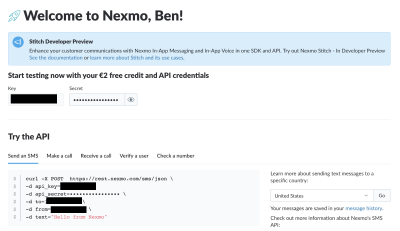

# Getting Started with Broadcasting Non-English SMS Messages with Rails and the Nexmo API   
*Ben Greenberg*

## Overview

In this article we are going to demonstrate how to create a Ruby on Rails application to broadcast SMS messages to a list of phone numbers. There is a multitude of use cases for broadcasting messages to employees, customers or clients. Whether you want to share the latest sale with your loyal customers, update employees on an important update or notify your clients of an upcoming schedule change, the ability to broadcast that message easily and efficiently is integral. With the help of the Nexmo Ruby Gem and the Nexmo API we can easily create an application to accomplish this. We can leverage the built in Unicode support of the Nexmo API to send SMS messages in any language, including languages that are not based on English characters, like Hebrew, Mandarin or Arabic.

Let's get started!

## Prerequisites

In order to begin our tutorial we are going to require the following:

* A [Nexmo account](https://dashboard.nexmo.com/sign-up) (free to sign up and get 2&euro; free credit!)
* [Rails](https://rubyonrails.org/) installed on your computer
* Basic comprehension of [Ruby](https://www.ruby-lang.org/en/documentation/)

## Setting Up Our Rails Application

To begin let's go ahead and initialize a new Rails application. This can be done by simply typing in the command line:

```
rails new name-of-app
```

At the time of initialization you can also specify the database you prefer, with `--database=[DATABASE]`. If you do not specify a database Rails will default to SQLite. You can also offer an additional flag of `-T` to skip installing the default unit tests. For example, with both flags specified your initialization would look like this: `rails new name-of-app --database=postgresql -T`, which would create a new Rails app running with a PostgreSQL database and no default tests installed. 

Once the installation completes we can open up the new directory in our preferred code editor. There are a few items we want to accomplish to make sure our application can handle non-English characters.

First, go ahead and open up the development configuration file found at `/config/environments/development.rb` and add the following line:

```ruby
 config.encoding = "utf-8"
 ```

 This ensures that our application can handle Unicode encoding, which will allow us to work with non-English characters. You can also add the above line to the `/config/environments/production.rb` file to equip the production version of our application with the same capability. 

 Lastly, in this step, we also want to update the opening `<html>` tag in the application layout file to accomodate whichever language we are writing in. This is good practice even if we are writing an English application since it makes our website more accessible to those utilizing screen readers and other assistive devices. When we open up the `application.html.erb` file in `/app/views/layouts/` we make the following adjustment:

 ```html
 <html lang="[USE TWO OR THREE LETTER CODE FOR YOUR LANGUAGE]"> 
 ```

 You can find the appropriate language code in the [Language Subtag Registry](http://www.iana.org/assignments/language-subtag-registry/language-subtag-registry). For example, if we were building an application in Hebrew, we would use `he` and if we were building an application in Hungarian we would use `hu`. Additionally, if the language you are using is read from right to left and not left to right, you can also add `dir="rtl"` in the opening `<html>` tag so that the browser knows to render the content in the appropriate direction.

 We are now ready to add the Nexmo Gem to our application and to acquire and safely store our API keys.

## Installing the Nexmo Gem and Acquiring Our API Keys

At this point we are now ready to install the Nexmo gem in our application! The Nexmo gem facilitates our interaction with the Nexmo API and is a powerful tool to bring the full suite of communications potential into our application. While we are installing the Nexmo gem we are also going to include the [dotenv](https://github.com/bkeepers/dotenv) gem as well. Dotenv allows us to safely store confidential information like API keys without exposing them to the wider Internet. 

In order to install the Nexmo gem open up your `Gemfile` found in the root directory of your project and add the following line near the top of the file:

```ruby
gem 'nexmo'
```

We also want to include the dotenv gem, but we only need it for development and testing, so we will group it in the `:development, :test` categories. Find the `group :development, :test` block in your `Gemfile` and add the following:

```ruby
gem 'dotenv-rails'
```

At this point after you save the file you are ready to incorporate these new gems into your app by executing the `bundle install` command from your command line. You will see in the output from the command that both the Nexmo and the dotenv-raisl gems were successfully installed. 

There is just a couple more steps necessary to make sure that our API keys can be stored securely. First, add the following file to your root directory: `.env`. The `.env` file is where we will store our API keys. Secondly, are you planning to maintain this project with Git version control? If so, make sure to also add `.gitignore` to your root directory, if it is already not there, and make sure that you add `.env` in your `.gitignore` file. This will ensure that Git will not commit your private keys to the repository where they could potentially be viewed by others.

Now let's obtain our API keys from Nexmo so we can interact with the Nexmo API and begin sending out SMS messages. This would be a good time to sign up for a free Nexmo account. You can do so by going to [https://dashboard.nexmo.com/sign-up](https://dashboard.nexmo.com/sign-up). It takes just a moment and once you are done you will discover 2&euro; of credit to begin exploring all that you can do. 

After creating an account you will see your dashboard, which looks like this:



As you can see there are two codes you need to access the API: the API key and the API secret. If you click the icon that looks like an eye you will reveal the API secret. Open up the `.env` file you created just a few moments ago and add the following:

```ruby
api_key=[YOUR API KEY]
api_secret=[YOUR API SECRET]
```

Make sure to replace `[YOUR API KEY]` and `[YOUR API SECRET]` with your actual API key and API secret. 

Congratulations you have now successfully installed the Nexmo gem, acquired your API keys and stored them safely and securely! You are now ready to go ahead and build your actual messenger logic and view. Let's dive in to our next step!

## Creating Our Message Logic and View


## To Recap


## Further Reading


